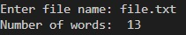

# Word-count
## AIM:
To write a python program for getting the word count from a text.
## EQUIPEMENT'S REQUIRED: 
PC
Anaconda - Python 3.7
## ALGORITHM: 
### Step 1:
Get the file name as the input from the user
### Step 2: 
Open the file using the withopen function
### Step 3: 
Use for loop and split function
### Step 4:  
Print the program
### Step 5: 
End the program

## PROGRAM:
```python

Developed by : Rama E.K. Lekshmi
Ref No : 22009028
fname = input('Enter file name: ')
num_words = 0
with open (fname, 'r') as f:
for line in f:
words = line.split()
num_words += len(words)
print('Number of words: ',num_words)
```

### OUTPUT:


## RESULT:
Thus the program is written to find the word count from a text.
